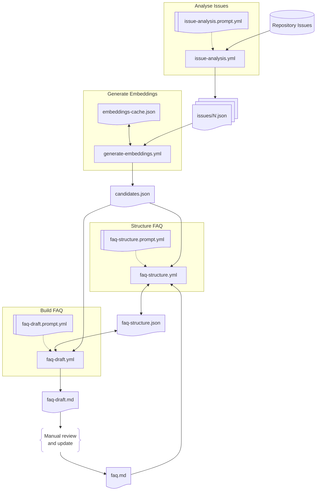

# GitHub Issues Analyser

Valuable advice and insights are often buried in GitHub issue comments. This knowledge is difficult to search, particularly for new users, and becomes harder to find as context shifts and details go stale.

**This project automatically extracts FAQ entries from GitHub issues**, using AI to identify patterns, cluster related topics, and maintain a living FAQ document that evolves with your project. Unlike one-off documentation generators, it maintains provenance, semantic embeddings, and structural metadata to support reliable incremental updates as new issues are raised and resolved.

## Key Features

- **Incremental Processing**: Performs a single inference at a time via scheduled GitHub Actions, staying within free-tier API rate limits
- **Semantic Clustering**: Uses embeddings and inference to group related topics, even when they use different terminology
- **Provenance Tracking**: Every FAQ entry links back to the source issues via HTML comments
- **Smart Updates**: Only reprocesses issues when they are updated or when AI prompts are refined
- **Manual Review**: Generates draft FAQs for human review before publication
- **Multi-Repository**: Can process issues from multiple repositories, maintaining independent FAQs for each

## How It Works

The system operates as a multi-stage pipeline, with each stage triggered by scheduled GitHub Actions:



1. **Analyse Issues**: Extract candidate FAQ entries from issue comments using AI
2. **Generate Embeddings**: Create semantic vectors for clustering related topics
3. **Structure FAQ**: Group candidates into categories based on semantic similarity
4. **Build FAQ**: Generate draft FAQ entries by merging related candidates
5. **Manual Review**: Human review and refinement before publication

Processing is performed by scheduled GitHub Actions workflows, with state checked back into the repo under the `data` directory, organised into subdirectories for each `owner/repo` being monitored. Each workflow run performs limited processing (e.g. a single AI inference step), continuing from the last state, to be robust and avoid exceeding API rate limits.

Candidate FAQ entries are tracked via identifiers of the form `issue-42-de3d` comprising the source issue number and a unique hash. These identifiers are embedded in the final FAQ as HTML comments, identifying which candidate entries contributed to each final FAQ entry, and which candidates have been explicitly excluded (e.g. due to being obsolete, out of scope, or otherwise undesirable). They are used in subsequent updates to restrict processing to new candidate entries, and to organise those new entries into the most appropriate sections.

> [!IMPORTANT]
> **This tool is designed for my specific use case.** It works well for technical open-source projects with detailed issue discussions, but may need significant customisation for other scenarios. Review the prompts carefully and adjust them to match your project's needs and tone.

> [!CAUTION]
> - This is **not** a general-purpose documentation generator
> - It is **not** guaranteed to produce correct answers without review
> - It is **not** a replacement for human editorial judgement
> - **Review all generated content** before publishing
> - **No support or stability guarantees are offered**

## Usage

### Quick Start

1. **Clone this repository** and delete the `data` folder
2. **Configure** your repositories in `bin/config.ts`
3. **Customise prompts** in `issue-analysis.prompt.yml`, `faq-structure.prompt.yml`, and `faq-draft.prompt.yml`
4. **Add Gemini API keys** as GitHub Actions secrets `GEMINI_API_KEY_ISSUE`, `GEMINI_API_KEY_STRUCT` and `GEMINI_API_KEY_FAQ`
5. **Wait** for issues to be processed (can take weeks for large backlogs)
6. **Review** `data/<owner>/<repo>/faq-draft.md` and commit as `faq.md`

### Key Files

```
github-issues-analyser/
├── .github/workflows/          # GitHub Actions workflows
│   ├── issue-analysis.yml      # Extract candidates from issues
│   ├── generate-embeddings.yml # Generate semantic embeddings
│   ├── faq-structure.yml       # Group candidates by similarity
│   └── faq-draft.yml           # Generate draft FAQ
├── bin/                        # TypeScript implementation
│   └── config.ts               # Repository configuration
├── data/<owner>/<repo>/        # Project-specific data
│   ├── candidates.json         # All candidate FAQ entries with embeddings
│   ├── embeddings-cache.json   # Cached embedding vectors
│   ├── faq.md                  # Published FAQ (manually reviewed)
│   ├── faq-draft.md            # Auto-generated FAQ draft
│   ├── faq-structure.json      # Categorised candidates
│   └── issues/#<n>.json        # Per-issue extraction results
├── issue-analysis.prompt.yml   # AI prompt for candidate extraction
├── faq-structure.prompt.yml    # AI prompt for assigning candidate categories
└── faq-draft.prompt.yml        # AI prompt for FAQ generation
```

### Initial Setup

To generate FAQs for your own projects:

1. **Create your copy**
   ```bash
   git clone https://github.com/thoukydides/github-issues-analyser.git
   cd github-issues-analyser
   rm -rf data/  # Remove project-specific data
   ```

2. **Configure repositories**
   
   Edit `bin/config.ts` to list the repositories you want to process:
   ```typescript
   export const CONFIG: ConfigRepository[] = [
       { owner: 'your-username', repo: 'your-repo' }
   ];
   ```

3. **Customise AI prompts**
   
   Tailor the instructions to match your project's characteristics:
   - `issue-analysis.prompt.yml`: Controls how FAQ candidates are extracted from issues
   - `faq-structure.prompt.yml`: Controls how candidates are assigned to categories within the FAQ
   - `faq-draft.prompt.yml`: Controls how candidates are merged into final FAQ entries
   
   Key areas to customise:
   - Technical terminology specific to your project
   - Tone and writing style preferences
   - What types of issues to include/exclude
   - How to handle maintainer policy decisions

   If you have changed the structured output JSON schema in any prompt then run `bin/build-zod-schema.ts` to regenerate the corresponding TypeScript types.

   If you refine the `issue-analysis.prompt.yml` prompt, update the `ISSUE_DATE_PREFERRED` date in `bin/lib/data/issues.ts` to reprocess all issues using the new instructions. Only change `ISSUE_DATE_COMPATIBLE` if you make incompatible changes to the structured output format.

4. **Create GitHub repository**
   
   Create a **new repository** (not a fork) and push your customised version:
   ```bash
   git remote set-url origin git@github.com:your-username/your-faq-project.git
   git push -u origin master
   ```

> [!TIP]
> **Create an independent repository** rather than forking. Otherwise, changes to my project's issue data will appear as upstream commits that you will need to manage.

5. **Add API credentials**
   
   Create three [Gemini API Keys](https://aistudio.google.com/api-keys) (free) and add them as GitHub Actions repository secrets named `GEMINI_API_KEY_ISSUE`, `GEMINI_API_KEY_STRUCT` and  `GEMINI_API_KEY_FAQ`. These should be in separate Google Cloud projects to enable independent rate limits.

6. **Wait for processing**
   
   GitHub Actions will begin processing issues automatically. Monitor progress in the Actions tab. For repositories with many existing issues, initial processing can take several weeks due to API rate limits.

> [!TIP]
> The GitHub Actions schedules are configured to stay within Google AI Studio's free tier (20 requests/day for `gemini-3-flash`). A repository with 500 closed issues will take ~25 days to process initially. Ongoing maintenance only processes updated issues, so will typically generate an updated FAQ draft within 1-2 days.

7. **Review and publish**
   
   Once processing is complete:
   - Review `data/<owner>/<repo>/faq-draft.md`
   - Edit as needed (fix errors, improve wording, reorganise sections)
   - **Preserve HTML comments** containing issue references (essential for incremental updates)
   - If entries are deleted, list their issue references to prevent future inclusion:
     ```html
       <!-- EXCLUDED: issue-13-25e1 issue-18-f5e2 -->
     ```
     This prevents the system from re-adding candidates you have deliberately removed (e.g. obsolete workarounds or out-of-scope topics)
   - Commit the reviewed version as `data/<owner>/<repo>/faq.md`

### Ongoing Maintenance

Once the initial FAQ is published:

- **New issues** are automatically analysed as they are created or updated
- **New candidates** are added to `faq-draft.md` in appropriate sections
- **Review changes** regularly and merge approved updates into `faq.md`

## ISC License (ISC)

<details>
<summary>Copyright © 2026 Alexander Thoukydides</summary>

> Permission to use, copy, modify, and/or distribute this software for any purpose with or without fee is hereby granted, provided that the above copyright notice and this permission notice appear in all copies.
>
> THE SOFTWARE IS PROVIDED "AS IS" AND THE AUTHOR DISCLAIMS ALL WARRANTIES WITH REGARD TO THIS SOFTWARE INCLUDING ALL IMPLIED WARRANTIES OF MERCHANTABILITY AND FITNESS. IN NO EVENT SHALL THE AUTHOR BE LIABLE FOR ANY SPECIAL, DIRECT, INDIRECT, OR CONSEQUENTIAL DAMAGES OR ANY DAMAGES WHATSOEVER RESULTING FROM LOSS OF USE, DATA OR PROFITS, WHETHER IN AN ACTION OF CONTRACT, NEGLIGENCE OR OTHER TORTIOUS ACTION, ARISING OUT OF OR IN CONNECTION WITH THE USE OR PERFORMANCE OF THIS SOFTWARE.
</details>