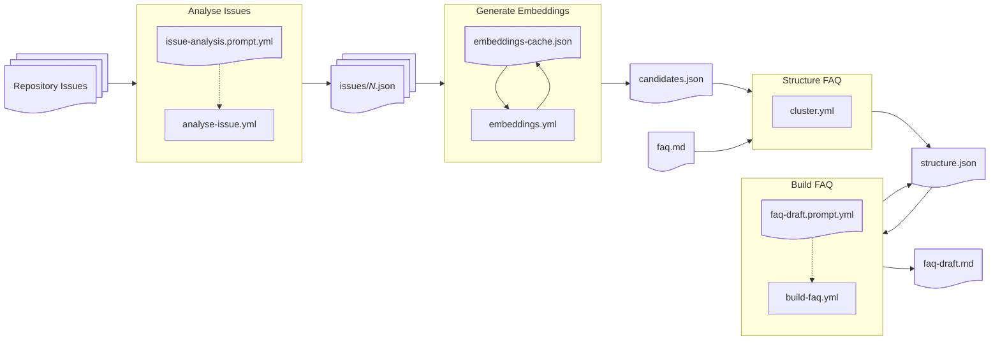

# GitHub Issues Analyser

Valuable advice and insights are often buried in GitHub issue comments. This knowledge is difficult to search, particularly for new users, and becomes harder as context shifts and details go stale.This project incrementally processes issues and maintains a structured FAQ over time, rather than generating a one-off static summary. The system maintains provenance, semantic embeddings, and structural metadata to support reliable incremental updates.

Processing is performed by scheduled GitHub Actions workflows, with state checked back into the repo under the `data` directory, organised into subdirectories for each `owner/repo` being monitored. Each workflow run performs limited processing (e.g. a single AI inference step), continuing from the last state, to be robust and avoid exceeding API rate limits.

Candidate FAQ entries are tracked via identifiers of the form `issue-42-de3d` comprising the source issue number and a unique hash. These identifiers are embedded in the final FAQ as HTML comments, identifying which candidate entries contributed to each final FAQ entry, and which candidates have been explicitly excluded (e.g. due to being obsolete, out of scope, or otherwise undesirable). They are used in subsequent updates to restrict processing to new candidate entries, and to organise those new entries into the most appropriate sections.

> [!CAUTION]
> This project was developed for my own use based on the characteristics of my own open source projects. If you are interested in trying it for yourself then follow the Usage instructions to customise and maintain your own copy. No support or stability guarantees are offered.

> [!NOTE]
> - This is **not** a general-purpose documentation generator.
> - It is **not** guaranteed to produce correct answers without review.
> - It is **not** a replacement for human editorial judgement.

## Usage

To generate FAQs for your own projects:
1. Checkout this project.
2. Delete the existing `data` folder (which contains project-specific state for my own repositories).
3. Customise the project:
   - Edit `bin/config.ts` with a list of the repositories to process.
   - Tailor the instructions in `issue-analysis.prompt.yml` and `faq-draft.prompt.yml` to suit your projects and preferences.
4. Create a new GitHub repository for your copy of this project, and commit your version.
5. Create a (free) Google AI Studio [Gemini API Key](https://aistudio.google.com/api-keys) and place it in a GitHub Actions Repository Secret named `GEMINI_API_KEY_ISSUE`.
6. Wait for the backlog of existing issues to be processed.
7. Review the generated `faq-draft.md`, edit as appropriate, and commit the revised version as `faq.md`. Ensure you retain the HTML comments with references to the source issues used to generate the FAQ entries; these are essential for incremental updates.

> [!TIP]
> Create an independent repository rather than a fork of this project. Otherwise changes to the issue and FAQ data for my projects will appear as upstream commits.

> [!TIP]
> The GitHub Actions workflow scheduled triggers have been selected to remain within the Google AI Studio free tier rate limits, especially the limit of 20 requests/day for the `gemini-3-flash` model. When this project is first used against an established repository with lots of existing issues it will take a long time to churn through the backlog of old issues. After this has completed only updated issues will be processed.

## Directory Structure

The most important files in this project are:
* `data/<owner>/<repo>/...`: Project-specific data:
  * `.../candidates.json`: A flat list of candidate FAQ entries from all issues, with their associated embeddings vectors.
  * `.../embeddings-cache.json`: Cache of all embeddings vectors generated for this project.
  * `.../faq.md`: The manually reviewed and edited FAQ.
  * `.../faq-draft.md`: The automatically generated or revised FAQ.
  * `.../issues/#<n>.json`: A file per issue processed containing the results of the AI inference to extract candidate FAQ entries.
  * `.../structure.json`: The parsed `faq.json` with all new `candidates.json` entries added into appropriate categories, updated as AI inference steps review and integrate the entries into each category.
* `faq-draft.prompt.yml`: AI prompt to review a collection of related FAQ entries (existing and new candidates) and generate a revised list.
* `issue-analysis-prompt.yml`: AI prompt to analyse a GitHub issue and generate candidate FAQ entries.

## ISC License (ISC)

Copyright © 2026 Alexander Thoukydides

> Permission to use, copy, modify, and/or distribute this software for any purpose with or without fee is hereby granted, provided that the above copyright notice and this permission notice appear in all copies.
>
> THE SOFTWARE IS PROVIDED "AS IS" AND THE AUTHOR DISCLAIMS ALL WARRANTIES WITH REGARD TO THIS SOFTWARE INCLUDING ALL IMPLIED WARRANTIES OF MERCHANTABILITY AND FITNESS. IN NO EVENT SHALL THE AUTHOR BE LIABLE FOR ANY SPECIAL, DIRECT, INDIRECT, OR CONSEQUENTIAL DAMAGES OR ANY DAMAGES WHATSOEVER RESULTING FROM LOSS OF USE, DATA OR PROFITS, WHETHER IN AN ACTION OF CONTRACT, NEGLIGENCE OR OTHER TORTIOUS ACTION, ARISING OUT OF OR IN CONNECTION WITH THE USE OR PERFORMANCE OF THIS SOFTWARE.

